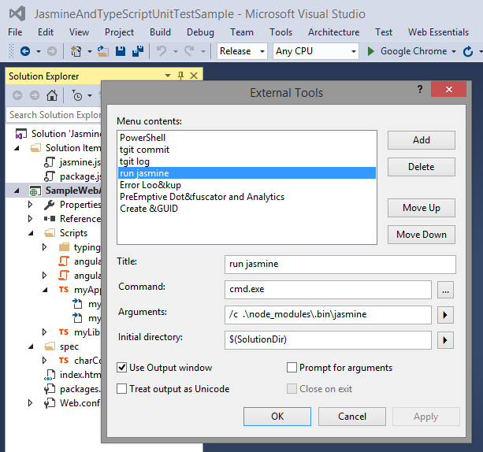
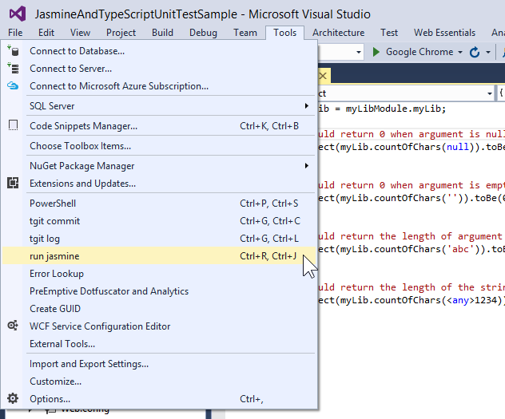
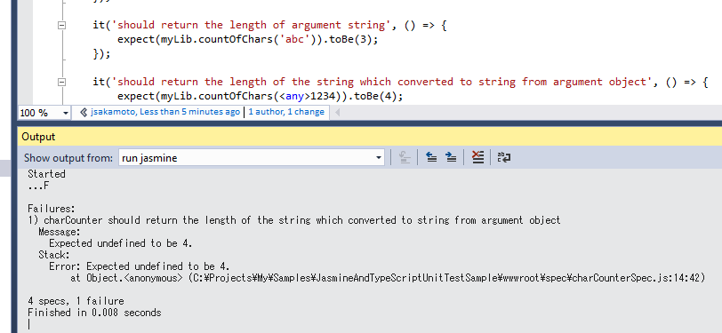

# How to integrate Unit Test of TypeScript codes on Jasmine framework with Visual Studio - Sample Project

## requirements

- Windows OS
- node.js (and `npm` command)
- Visual Studio (ver.2010, 2012, 2013, 2015 or higher)

## preparing running test environment

1. open command prompt.
2. change current directory to solution folder.
3. execute `npm install`. Then, `jasmine` command is downloaded and install into `.\node_modules\.bin` foder.

## configure Visual Studio

1. Add external tools to launch `jasmine` commnad like bellow:  
  
Don't miss check on `Use Output window` option.

2. Assign keyboard shortcut `Ctrl`+`R` and `Ctrl` + `J` combination (it means "**R**un **J**asmine") to launch `jasmine` commnad.  

## run test

1. open this solution by Visual Studio.
2. Enter keyboard shortcut `Ctrl`+`R` and `Ctrl` + `J` combination.
3. Then, `jasmine` command is executed and the result of running test shown in Visual Studio output window.  

